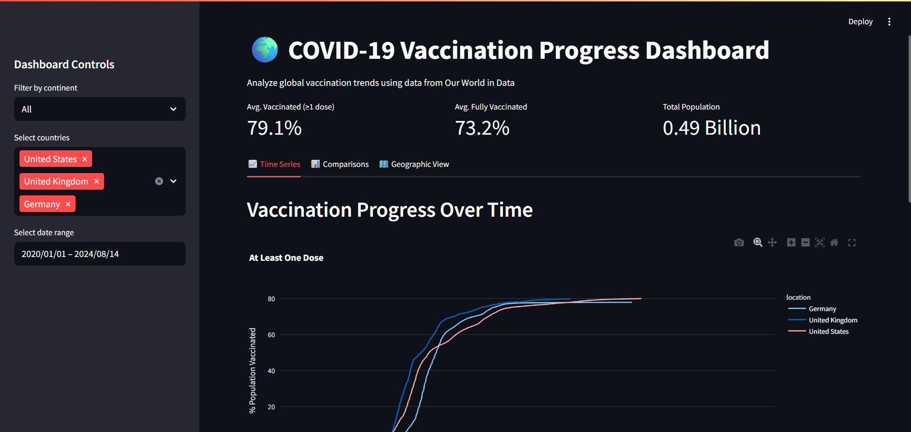
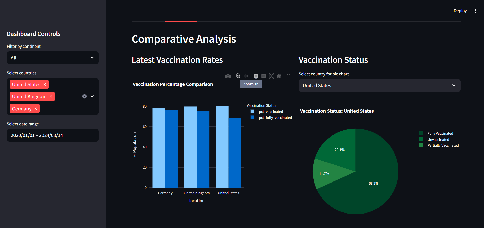
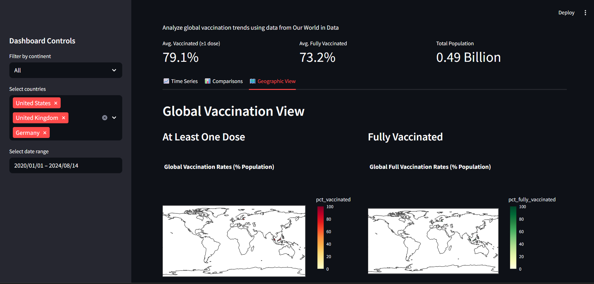

# COVID-19 Global Data Tracker





## Overview
The **COVID-19 Global Data Tracker** is an interactive web application built with Streamlit to analyze and visualize global COVID-19 trends. It uses data from [Our World in Data](https://ourworldindata.org/coronavirus) to display metrics like total cases, deaths, vaccination coverage, and hospitalization/ICU data (if available). Users can select countries, filter by date range (with a time-series dataset), and explore visualizations including bar charts and a choropleth map.

### Features
- **User Input**: Select multiple countries via a dropdown and filter by date range (if using time-series data).
- **Visualizations**: Bar charts for total cases, death rate, vaccination coverage, and hospitalization/ICU rates (if available); interactive choropleth map for global case distribution.
- **Dynamic Filtering**: Real-time updates to data and visuals based on user selections.
- **Hospitalization/ICU Data**: Includes these metrics if present in the dataset, with fallback messages if not.
- **Insights**: Summarizes key findings, such as high case loads or vaccination leaders.

## Repository Structure
```
COVID-19-Dashboard/
├── vaccination_dashboard.py              # Streamlit app script
├── owid-covid-data.csv     # Latest COVID-19 data (single date per country)
├── requirements.txt          # Python dependencies
├── README.md                 # Project documentation
├── .gitignore                # Git ignore file
├── total_cases_bar.png       # Example visualization output
├── death_rate_bar.png        # Example visualization output
├── vaccination_coverage_bar.png  # Example visualization output
├── choropleth_map.html       # Interactive map output
```

## Prerequisites
- **Python**: Version 3.8 or higher
- **Git**: For version control
- **GitHub Account**: To host the repository
- **Dataset**: Either `owid-covid-latest.csv` (single-date) or `owid-covid-data.csv` (time-series)
- **Browser**: For viewing the Streamlit app

## Setup Instructions
Follow these steps to set up and run the project locally.

### 1. Clone the Repository
```bash
git clone https://github.com/your-username/COVID-19-Dashboard.git
cd COVID-19-Dashboard
```

### 2. Install Dependencies
Create a virtual environment (optional but recommended) and install required libraries:
```bash
python -m venv venv
source venv/bin/activate  # On Windows: venv\Scripts\activate
pip install -r requirements.txt
```

The `requirements.txt` includes:
```
streamlit==1.38.0
pandas==2.2.2
matplotlib==3.9.2
seaborn==0.13.2
plotly==5.24.1
```

### 3. Prepare the Dataset
- **Default Dataset**: Place `owid-covid-latest.csv` in the project folder. This dataset contains the latest COVID-19 data for each country (single date).
- **Time-Series Dataset**: For date range filtering, download `owid-covid-data.csv` from [Our World in Data](https://github.com/owid/covid-19-data/tree/master/public/data) and replace `owid-covid-latest.csv`. Update `dashboard.py` to load `owid-covid-data.csv`:
  ```python
  df = pd.read_csv('owid-covid-data.csv')
  ```

### 4. Run the Streamlit App
```bash
streamlit run vaccination_dashboard.py
```
- A browser window will open at `http://localhost:8501`.
- Use the sidebar to select countries and (if using `owid-covid-data.csv`) a date range.
- Explore the data table, visualizations, and insights.

## Dataset Details
- **Source**: [Our World in Data COVID-19 Dataset](https://ourworldindata.org/coronavirus)
- **Files**:
  - `owid-covid-latest.csv`: Latest data snapshot (one row per country, ~237 rows, 66 columns).
  - `owid-covid-data.csv`: Full time-series data (daily records, ~1M+ rows).
- **Key Columns**:
  - `location`: Country/region name
  - `iso_code`: ISO 3166-1 alpha-3 country code
  - `last_updated_date` (or `date` in time-series): Data date
  - `total_cases`: Cumulative confirmed cases
  - `total_deaths`: Cumulative deaths
  - `total_vaccinations`: Total vaccine doses administered
  - `people_vaccinated`: People with at least one dose
  - `population`: Country population
  - `hosp_patients` (if available): Current hospitalized patients
  - `icu_patients` (if available): Current ICU patients
- **Notes**:
  - `owid-covid-latest.csv` lacks time-series data, disabling date range filtering.
  - Hospitalization/ICU data is sparse, especially in `owid-covid-latest.csv`.

## Complete Workflow
This section describes the end-to-end process to develop, run, and deploy the project.

### Step 1: Data Acquisition
- Download `owid-covid-latest.csv` or `owid-covid-data.csv` from [Our World in Data](https://github.com/owid/covid-19-data/tree/master/public/data).
- Place the dataset in the project folder.

### Step 2: Data Preprocessing
- **Loading**: The `dashboard.py` script loads the dataset using pandas.
- **Cleaning**:
  - Converts `last_updated_date` (or `date`) to datetime.
  - Filters out non-country entries (e.g., "World", "Asia").
  - Handles missing values by filling key columns (`total_cases`, `total_deaths`, etc.) with 0.
- **Metrics**:
  - Calculates death rate (`total_deaths / total_cases * 100`).
  - Calculates vaccination coverage (`people_vaccinated / population * 100`).
  - If available, calculates hospitalization rate (`hosp_patients / total_cases * 100`) and ICU rate (`icu_patients / total_cases * 100`).

### Step 3: User Interaction
- **Country Selection**: Users choose countries via a multiselect dropdown in the Streamlit sidebar.
- **Date Range**: Enabled for `owid-covid-data.csv`, allowing users to filter by start and end dates. Disabled with a warning for `owid-covid-latest.csv`.
- **Dynamic Updates**: Data table and visualizations update based on user inputs.

### Step 4: Visualization
- **Bar Charts** (using Seaborn/Matplotlib):
  - Total cases by country
  - Death rate by country
  - Vaccination coverage by country
  - Hospitalization rate (if data available)
  - ICU rate (if data available)
- **Choropleth Map** (using Plotly):
  - Interactive global map showing total cases by country, with hover details.
- **Output Files**:
  - Charts are displayed in the app but can be saved locally (e.g., `total_cases_bar.png`).
  - The choropleth map is saved as `choropleth_map.html`.

### Step 5: Insights
- The dashboard summarizes findings, e.g.:
  - United States has the highest case load.
  - Brazil may have a higher death rate than Germany.
  - Germany leads in vaccination coverage.
  - Notes on hospitalization/ICU data availability and date range limitations.

### Step 6: Committing to GitHub
1. Initialize a Git repository:
   ```bash
   git init
   echo ".ipynb_checkpoints/" > .gitignore
   ```
2. Add files:
   ```bash
   git add dashboard.py owid-covid-latest.csv requirements.txt README.md
   git add total_cases_bar.png death_rate_bar.png vaccination_coverage_bar.png choropleth_map.html
   ```
3. Commit:
   ```bash
   git commit -m "Initial commit: Add Streamlit dashboard and assets"
   ```
4. Push to GitHub:
   ```bash
   git remote add origin https://github.com/your-username/COVID-19-Dashboard.git
   git push -u origin main
   ```

### Step 7: Deployment (Optional)
Deploy the app to [Streamlit Cloud](https://share.streamlit.io/):
1. Push the repository to GitHub.
2. Sign up at Streamlit Cloud and connect your GitHub account.
3. Select the repository and `dashboard.py` as the main script.
4. Ensure `requirements.txt` is included.
5. Deploy and share the public URL.

## Usage
1. Run `streamlit run dashboard.py`.
2. In the sidebar:
   - Select countries (e.g., United States, India, Brazil).
   - If using `owid-covid-data.csv`, choose a date range.
3. View:
   - Filtered data table.
   - Bar charts for cases, deaths, vaccinations, and hospitalization/ICU (if available).
   - Interactive choropleth map.
   - Key insights summarizing trends.

## Example Output
- **Data Table**: Shows selected countries with metrics like `total_cases`, `death_rate`, and `vaccination_coverage`.
- **Visualizations**:
  - Bar chart showing the United States with ~103M cases, far exceeding others.
  - Choropleth map highlighting high case loads in North America and Europe.
- **Insights**:
  - Germany leads in vaccination coverage (~70-80%).
  - Hospitalization/ICU data may be missing for some countries.

## Limitations
- **Single-Date Dataset**: `owid-covid-latest.csv` lacks time-series data, disabling date range filtering. Use `owid-covid-data.csv` for this feature.
- **Hospitalization/ICU Data**: Sparse in `owid-covid-latest.csv`. The time-series dataset has more data but still has gaps.
- **File Size**: Large datasets like `owid-covid-data.csv` may require Git LFS or manual upload to GitHub.
- **Browser Compatibility**: Streamlit works best in modern browsers (Chrome, Firefox).

## Troubleshooting
- **Dataset Not Found**:
  - Ensure `owid-covid-latest.csv` or `owid-covid-data.csv` is in the project folder.
  - Update the dataset path in `dashboard.py` if needed.
- **Missing Hospitalization/ICU Data**:
  - Check the dataset for `hosp_patients` or `icu_patients` columns.
  - Use `owid-covid-data.csv` for better coverage.
- **Streamlit Errors**:
  - Verify library versions (`pip install -r requirements.txt`).
  - Check for Python 3.8+.
- **GitHub Push Issues**:
  - Use a personal access token for authentication.
  - For large files, use Git LFS: `git lfs track "*.csv"`.

## Future Enhancements
- Add line charts for time-series trends (cases/deaths over time).
- Include additional metrics (e.g., reproduction rate, testing data).
- Add export options for data and charts (CSV/PNG).
- Support alternative dashboards (e.g., Dash or Flask).
- Integrate real-time data updates via an API.

## Contributing
1. Fork the repository.
2. Create a branch: `git checkout -b feature-name`.
3. Commit changes: `git commit -m "Add feature"`.
4. Push: `git push origin feature-name`.
5. Open a pull request on GitHub.


## Acknowledgments
- [Our World in Data](https://ourworldindata.org/coronavirus) for the dataset.
- [Streamlit](https://streamlit.io/) for the interactive dashboard framework.
- [Plotly](https://plotly.com/) and [Seaborn](https://seaborn.pydata.org/) for visualizations.

## Contact
For questions or feedback, open an issue on GitHub or contact [brownjohn9870@gmail.com](mailto:brownjohn9870@gmail.com).
